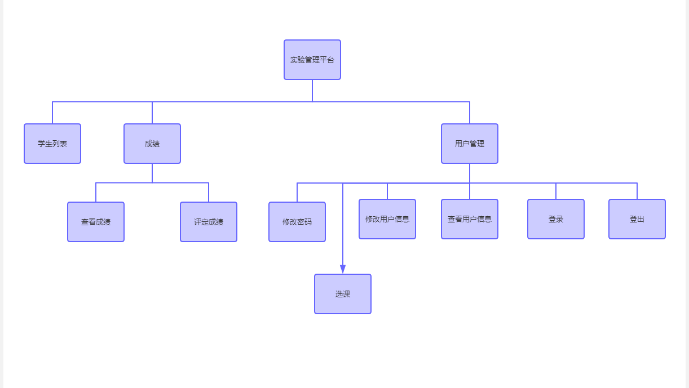
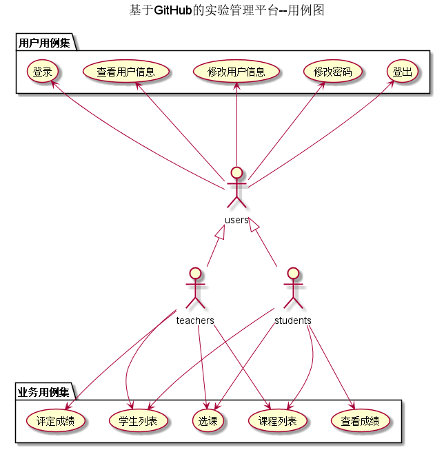

# # 基于GitHub的实验管理平台的分析与设计
## 1. 概述
- 基于GitHub的实验管理平台的作用是在线管理实验成绩的Web应用系统。学生和老师的实验内容均存放在GitHUB
页面上。
- 学生的功能主要有：
- 1.个人信息查询，修改以及密码修改  
- 2.查询课程的实验成绩
- 老师的功能主要有：
- 1.个人信息查询和修改，以及密码修改  
- 2.对学生的实验进行评定分数以及修改
- 3.查询学生的实验成绩
## 2. 系统总体结构

界面设计参见：https://zwdbox.github.io/is_analysis/test6/ui/index.html
    
## 3. 用例图设计 [源码](UML-631.puml)

## 4. 类图设计 [源码](UMl-641.puml)

## 5. 数据库设计
- ### [参见数据库设计](database.md)

## 6. 用例及界面详细设计  
- ### [“登录”用例](./用例/登录.md),[界面](https://Anyac-cm.github.io/is_analysis/test6/界面/登录.html) 
- ### [“查看用户信息”用例](./用例/查看用户信息.md),[界面](https://Anyac-cm.github.io/is_analysis/test6/界面/用户界面老师.html)
- ### [“修改用户信息”用例](./用例/修改用户信息.md),[界面](https://Anyac-cm.github.io/is_analysis/test6/界面/用户信息老师.html)
- ### [“修改密码”用例](./用例/修改密码.md),[界面](https://Anyac-cm.github.io/is_analysis/test6/界面/修改密码.html)
- ### [“登出”用例](./用例/登出.md),[界面](https://Anyac-cm.github.io/is_analysis/test6/界面/登录.html)
- ### [“评定成绩”用例](./用例/评定成绩.md),[界面](https://Anyac-cm.github.io/is_analysis/test6/界面/评定成绩.html)
- ### [“学生列表”用例](./用例/学生列表.md),[界面](https://Anyac-cm.github.io/is_analysis/test6/界面/index.html)
- ### [“选课”用例](./用例/成绩列表.md),[界面](https://Anyac-cm.github.io/is_analysis/test6/界面/选课.html)
- ### [“课程列表”用例](./用例/课程列表.md),[界面](https://Anyac-cm.github.io/is_analysis/test6/界面/选课.html)
- ### [“查看成绩”用例](./用例/查看成绩.md),[界面](https://Anyac-cm.github.io/is_analysis/test6/界面/查看成绩.html)

    